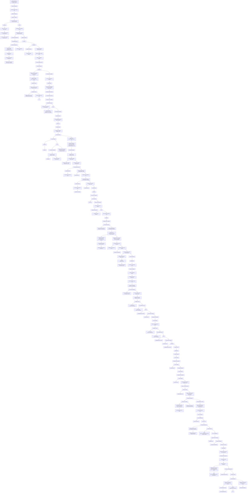

# bbn-cp diagram

```mermaid

graph TD;

E1["`Resets all values of $currentResult which are not ‘DEL’ to ‘TMP’`"]
E2["`Creates a data object`"]
E3["`Defines variables for later use`"]
E4["`Defines a final Array`"]
E5["`template = treatRoot:`"]
E6["`If the template has one item at its root which:`"]
E7["`has items`"]
E8["`doesn’t have a if, for, model, forget`"]
E9["`Is not a component (or this very component)`"]
E10["`Is a div, a span, or has the component’s tag`"]
E11["`Then:`"]
E12["`Adding values of attributes to props`"]
E13["`Setting directives’ values in this.$el.bbnSchema`"]
E14["`If first build insertDirectives`"]
E15["`Else updateDirectives`"]
E16["`updateFromSchema`"]
E17["`If events:`"]
E18["`Sets the eventListener:`"]
E19["`Checking modifiers, stopping if don’t correspond to the event`"]
E20["`Evaluating event’s expression`"]
E21["`Checking which data has changed after`"]
E22["`Adding event’s properties (once, passive, capture)`"]
E23["`Returns the template’s items`"]
E24["`Otherwise:`"]
E25["`updateFromSchema`"]
E26["`Returns the original template`"]
E27["`// STARTING NODES nodesToFunction`"]
E28["`Setting a conditions empty Array`"]
E29["`Setting a conditionId variable`"]
E30["`For each template’s node`"]
E31["`If the node has loop`"]
E32["`treatLoop:`"]
E33["`Setting a variable varName the value of the loop expression`"]
E34["`Setting a variable isNumber if this value is a number`"]
E35["`Setting the parent`"]
E36["`Setting a variable isArray if this value is an array`"]
E37["`If isNumber is true`"]
E38["`Making varName an array filled with numeric indexes`"]
E39["`Setting a variable old as false`"]
E40["`??`"]
E41["`If the node has condition`"]
E42["`If it is in a new group of conditions`"]
E43["`treatCondition:`"]
E44["`tmp is all the nodes filtered on the same idCondition than the node`"]
E45["`setting isCondTrue to false`"]
E46["`For each elements of tmp:`"]
E47["`New go var is set to false`"]
E48["`If isCondTrue is false`"]
E49["`isCondTrue is the result of the if expression`"]
E50["`Else`"]
E51["`The result of the if expression is set to false (whatever is its real value)`"]
E52["`If the result has changed`"]
E53["`go becomes true`"]
E54["`New var tmp1 for the result of the if statement`"]
E55["`New var e`"]
E56["`If tmp1 is false`"]
E57["`If node.tag is template, transition or slot`"]
E58["`If node has items`"]
E59["`For each of them`"]
E60["`retrieve it`"]
E61["`remove it`"]
E62["`else`"]
E63["`e = retrieve the element`"]
E64["`If e exists and is not already a comment`"]
E65["`removing e`"]
E66["`If the comment doesn’t exist create one`"]
E67["`Dealing with the particular else case (No value) and opening the brackets`"]
E68["`Retrieves the corresponding element in old`"]
E69["`Creating a variable go which says if we should process the node: if not already defined, go = !old`"]
E70["`If the node has forget`"]
E71["`Getting the forget expression’s value`"]
E72["`If the forgotten variable does not exist`"]
E73["`forgotten variable creation (with hash or _root)`"]
E74["`The forgotten variable is the forget value`"]
E75["`If the forget value is true`"]
E76["`go becomes false`"]
E77["`The parent will remain the same`"]
E78["`Else if the forget value is changed (NEW or MOD)`"]
E79["`go becomes true`"]
E80["`Setting new var treatEle to true`"]
E81["`If node doesn’t have pre, and is template or transition`"]
E82["`go becomes false`"]
E83["`The parent will remain the same`"]
E84["`treatEle is set to false`"]
E85["`Otherwise if the element doesn’t exist`"]
E86["`go becomes true`"]
E87["`If node has text`"]
E88["`treatText:`"]
E89["`New var ele is element`"]
E90["`If ele not found`"]
E91["`go is true`"]
E92["`New var val is text value`"]
E93["`If ele’s text and val are different`"]
E94["`Setting ele.textContent`"]
E95["`If go`"]
E96["`Creating text node: createText`"]
E97["`Else if node has tag which is slot`"]
E98["`treatSlot`"]
E99["`Variable slot set to ‘default’`"]
E100["`If the node has name`"]
E101["`slot set to this name (or the evaluation of its expression)`"]
E102["`Foreach bbnSlots[slot] of the component’s element`"]
E103["`If the parent is a component but is not the current component`"]
E104["`Looking for the element through bbnId and bbnHash in the parent’s bbnSlots`"]
E105["`If found replaces with the current slot element`"]
E106["`Otherwise adds the current slot element`"]
E107["`Otherwise if the current slot element is not connected (has no parentNode)`"]
E108["`If the parent is the current component`"]
E109["`Adding the slot element to final.  !!!`"]
E110["`Otherwise looking for the element`"]
E111["`Replacing or Appending`"]
E112["`Launching treatItems with the same parent:`"]
E113["`Adding current element in parents array !!!`"]
E114["`Launching nodesToFunction`"]
E115["`Removing current element from parents array !!!`"]
E116["`Else if node has tag`"]
E117["`setProperties:`"]
E118["`Creates an empty object props`"]
E119["`If there are attributes`"]
E120["`If there is a bbn-bind attribute`"]
E121["`Evaluate the value in a variable tmp1`"]
E122["`If it has changed set go to true`"]
E123["`Creates a new variable tmp2 with an empty object`"]
E124["`For each other attribute:`"]
E125["`Set tmp2[attribute] based on evaluation or value`"]
E126["`for each unique key from tmp1 and tmp2`"]
E127["`tmp2 prevails on tmp1 (attributes over bind)`"]
E128["`If attribute is class`"]
E129["`props.class is bbn.cp.convertClasses`"]
E130["`Else if attribute is style:`"]
E131["`props.style is bbn.cp.convertStyles`"]
E132["`Else`"]
E133["`props[attribute] is the value`"]
E134["`If the value has changed`"]
E135["`go becomes true`"]
E136["`Otherwise (no bbn-bind):`"]
E137["`for each attribute`"]
E138["`If there is an expression to evaluate`"]
E139["`If attribute is class`"]
E140["`props.class is bbn.cp.convertClasses`"]
E141["`Else if attribute is style:`"]
E142["`props.style is bbn.cp.convertStyles`"]
E143["`Else`"]
E144["`props[attribute] is the value`"]
E145["`If the value has changed`"]
E146["`go becomes true`"]
E147["`Otherwise`"]
E148["`props[attribute] is the value`"]
E149["`If treatEle is true`"]
E150["`treatElement:`"]
E151["`If node has model`"]
E152["`For each model`"]
E153["`Evaluate their expression`"]
E154["`If it has changed`"]
E155["`go becomes true`"]
E156["`If node has directives`"]
E157["`For each directive`"]
E158["`Evaluate their expression`"]
E159["`If it has changed`"]
E160["`go becomes true`"]
E161["`If go and doesn’t belong to forgotten array`"]
E162["`tmp1 is a new node’s clone`"]
E163["`If there is a hash`"]
E164["`tmp1.loopHash is set`"]
E165["`props is set with the props from setProperties (tmp1.props)`"]
E166["`If the tag is component`"]
E167["`If props.is is an object`"]
E168["`tmp1.tag becomes the name (with camelToCss)if there is or bbn-anon`"]
E169["`tmp1.cfg becomes the is object`"]
E170["`Otherwise we presume it’s its name (with camelToCss)`"]
E171["`New variable anew = false`"]
E172["`If the existing element is not the component and is not forgotten and`"]
E173["`Or there is no existing element`"]
E174["`Or it is a comment`"]
E175["`Or it’s a different tag`"]
E176["`anew becomes true`"]
E177["`If anew is true`"]
E178["`Foreach model in tmp1`"]
E179["`tmp1.model.value is set to the evaluation of expression`"]
E180["`Setting the same value to props[modelName[`"]
E181["`Foreach directives`"]
E182["`Setting tmp1.directives[directiveName].value through evaluation`"]
E183["`Ele = createElement`"]
E184["`If parent is the component`"]
E185["`Adding to final`"]
E186["`If there are directives`"]
E187["`Launches insertDirectives`"]
E188["`Else (anew is not true)`"]
E189["`If model exists`"]
E190["`model on tmp1 is set to the one in bbnSchema`"]
E191["`Foreach model in tmp1 who`"]
E192["`If the index is named _default_`"]
E193["`If the element is a component`"]
E194["`Setting the prop’s name to the model.prop  property from the configuration or to ‘value’`"]
E195["`Setting tmp1.model[propName].value (not _default_) !!!`"]
E196["`Else (it’s an HTML element)`"]
E197["`Setting model.value.value`"]
E198["`If directives exists`"]
E199["`Foreach directives`"]
E200["`If it has an expression to evaluate and the result is not ‘OK’`"]
E201["`Set the directive’s value`"]
E202["`Launch updateDirectives`"]
E203["`Launches updateElementFromProps`"]
E204["`???`"]
E205["`Inserting all elements from final Array in the root element`"]
E206["`Returns $currentResult`"]
E1 --> E2
E2 --> E3
E3 --> E4
E4 --> E5
E5 --> E6
E6 --> E7
E7 --> E8
E8 --> E9
E9 --> E10
E6 --> E11
E11 --> E12
E12 --> E13
E13 --> E14
E14 --> E15
E13 --> E16
E16 --> E17
E17 --> E18
E18 --> E19
E19 --> E20
E20 --> E21
E21 --> E22
E18 --> E23
E17 --> E24
E24 --> E25
E25 --> E26
E24 --> E27
E27 --> E28
E28 --> E29
E29 --> E30
E30 --> E31
E31 --> E32
E32 --> E33
E33 --> E34
E34 --> E35
E35 --> E36
E36 --> E37
E37 --> E38
E37 --> E39
E39 --> E40
E32 --> E41
E41 --> E42
E42 --> E43
E43 --> E44
E44 --> E45
E45 --> E46
E46 --> E47
E47 --> E48
E48 --> E49
E48 --> E50
E50 --> E51
E50 --> E52
E52 --> E53
E53 --> E54
E54 --> E55
E55 --> E56
E56 --> E57
E57 --> E58
E58 --> E59
E59 --> E60
E60 --> E61
E59 --> E62
E62 --> E63
E63 --> E64
E64 --> E65
E64 --> E66
E62 --> E67
E58 --> E68
E68 --> E69
E69 --> E70
E70 --> E71
E71 --> E72
E72 --> E73
E72 --> E74
E74 --> E75
E75 --> E76
E76 --> E77
E75 --> E78
E78 --> E79
E78 --> E80
E80 --> E81
E81 --> E82
E82 --> E83
E83 --> E84
E81 --> E85
E85 --> E86
E85 --> E87
E87 --> E88
E88 --> E89
E89 --> E90
E90 --> E91
E90 --> E92
E92 --> E93
E93 --> E94
E93 --> E95
E95 --> E96
E95 --> E97
E97 --> E98
E98 --> E99
E99 --> E100
E100 --> E101
E100 --> E102
E102 --> E103
E103 --> E104
E104 --> E105
E105 --> E106
E103 --> E107
E107 --> E108
E108 --> E109
E108 --> E110
E110 --> E111
E110 --> E112
E112 --> E113
E113 --> E114
E114 --> E115
E112 --> E116
E116 --> E117
E117 --> E118
E118 --> E119
E119 --> E120
E120 --> E121
E121 --> E122
E122 --> E123
E123 --> E124
E124 --> E125
E124 --> E126
E126 --> E127
E127 --> E128
E128 --> E129
E128 --> E130
E130 --> E131
E130 --> E132
E132 --> E133
E132 --> E134
E134 --> E135
E134 --> E136
E136 --> E137
E137 --> E138
E138 --> E139
E139 --> E140
E139 --> E141
E141 --> E142
E141 --> E143
E143 --> E144
E143 --> E145
E145 --> E146
E145 --> E147
E147 --> E148
E147 --> E149
E149 --> E150
E150 --> E151
E151 --> E152
E152 --> E153
E153 --> E154
E154 --> E155
E154 --> E156
E156 --> E157
E157 --> E158
E158 --> E159
E159 --> E160
E159 --> E161
E161 --> E162
E162 --> E163
E163 --> E164
E163 --> E165
E165 --> E166
E166 --> E167
E167 --> E168
E168 --> E169
E167 --> E170
E166 --> E171
E171 --> E172
E172 --> E173
E173 --> E174
E174 --> E175
E175 --> E176
E175 --> E177
E177 --> E178
E178 --> E179
E179 --> E180
E178 --> E181
E181 --> E182
E181 --> E183
E183 --> E184
E184 --> E185
E184 --> E186
E186 --> E187
E186 --> E188
E188 --> E189
E189 --> E190
E190 --> E191
E191 --> E192
E192 --> E193
E193 --> E194
E194 --> E195
E193 --> E196
E196 --> E197
E196 --> E198
E198 --> E199
E199 --> E200
E200 --> E201
E201 --> E202
E200 --> E203
E203 --> E204
E199 --> E205
E205 --> E206
```

